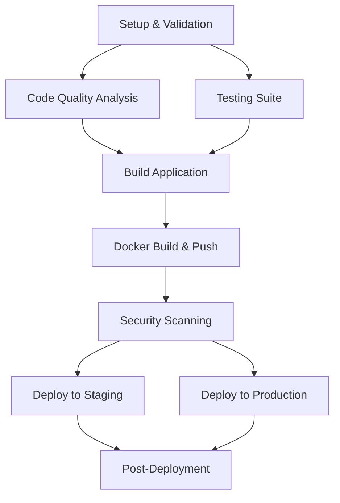

# 🚀 CI/CD Documentation - BibleVerse

## Overview

BibleVerse uses a comprehensive, enterprise-level CI/CD pipeline built with GitHub Actions. The pipeline ensures code quality, security, and reliable deployments across multiple environments.

## Pipeline Architecture

### 🔄 Workflow Triggers

- **Push to main** → Production deployment
- **Push to develop** → Staging deployment  
- **Pull Requests** → Quality checks and testing
- **Manual dispatch** → Flexible deployment to any environment
- **Releases** → Tagged production deployment

### 📋 Pipeline Stages



## Detailed Stage Breakdown

### 1. 📋 Setup & Validation
- **Version generation** - Semantic versioning based on triggers
- **Deployment strategy** - Determines target environment
- **Cache key generation** - Optimizes build times

### 2. 🔍 Code Quality Analysis
- **Prettier** - Code formatting validation
- **ESLint** - Code quality and consistency
- **SonarQube** - Comprehensive quality analysis
- **Security audit** - npm vulnerability scanning

### 3. 🧪 Testing Suite
- **Unit tests** - Component and service testing
- **Integration tests** - API and service integration
- **E2E tests** - End-to-end user workflows
- **Coverage reports** - Code coverage analysis

### 4. 🏗️ Build Application
- **Multi-environment builds** - Development, staging, production
- **Bundle analysis** - Performance optimization
- **Artifact storage** - Build artifact management

### 5. 🐳 Docker Build & Push
- **Multi-stage builds** - Optimized container images
- **Multi-platform** - AMD64 and ARM64 support
- **Registry push** - GitHub Container Registry
- **Image tagging** - Semantic and environment tags

### 6. 🛡️ Security Scanning
- **Container scanning** - Trivy vulnerability analysis
- **SARIF reporting** - Security findings integration
- **Dependency scanning** - Third-party vulnerability check

### 7. 🚀 Deployment
- **Environment-specific** - Staging and production
- **Blue-green deployment** - Zero-downtime updates
- **Smoke tests** - Post-deployment validation
- **Rollback capability** - Automatic failure recovery

### 8. 📊 Post-Deployment
- **Monitoring setup** - Health check configuration
- **Notification** - Slack/email deployment alerts
- **Documentation** - Automated deployment logs

## Environment Configuration

### Development
- **Purpose**: Local development and testing
- **Features**: Hot reload, debugging, extended logging
- **Security**: Relaxed for development convenience
- **Performance**: Unoptimized for fast compilation

### Staging
- **Purpose**: Pre-production testing and validation
- **Features**: Production-like environment, analytics
- **Security**: Production-level security measures
- **Performance**: Optimized builds with source maps

### Production
- **Purpose**: Live application serving users
- **Features**: Full optimization, analytics, PWA
- **Security**: Maximum security configuration
- **Performance**: Fully optimized, compressed assets

## Quality Gates

### Code Quality Requirements
- **ESLint**: Maximum 0 warnings
- **Test coverage**: Minimum 80% coverage
- **Security**: No high/critical vulnerabilities
- **Performance**: Bundle size under limits

### Deployment Gates
- **All tests pass**: Unit, integration, E2E
- **Quality gates pass**: SonarQube quality gate
- **Security scan clean**: No critical vulnerabilities
- **Manual approval**: Production deployments

## Secrets and Environment Variables

### Required Secrets
```yaml
# GitHub Actions Secrets
SONAR_TOKEN: SonarQube authentication token
SLACK_WEBHOOK_URL: Deployment notifications
GITHUB_TOKEN: Container registry access (auto-provided)

# Environment Variables (per environment)
NODE_ENV: production|staging|development
ENVIRONMENT: production|staging|development
VERSION: Semantic version string
```

### Secret Management
- **GitHub Secrets**: Centralized secret storage
- **Environment-specific**: Separate secrets per environment
- **Rotation policy**: Regular secret rotation
- **Access control**: Limited secret access

## Monitoring and Observability

### Build Metrics
- **Build duration**: Track pipeline performance
- **Success rate**: Monitor deployment reliability
- **Failure analysis**: Automated failure reporting

### Application Metrics
- **Performance**: Core Web Vitals, bundle size
- **Errors**: Runtime error tracking
- **Usage**: User interaction analytics
- **Availability**: Uptime monitoring

## Rollback Strategy

### Automatic Rollback
- **Health check failures**: Auto-rollback on failing health checks
- **Error rate spike**: Rollback on increased error rates
- **Performance degradation**: Rollback on performance issues

### Manual Rollback
```bash
# Rollback to previous version
kubectl rollout undo deployment/bibleverse-production -n bibleverse-production

# Rollback to specific version
kubectl rollout undo deployment/bibleverse-production --to-revision=2 -n bibleverse-production
```

## Troubleshooting

### Common Issues

#### Build Failures
```bash
# Clear cache and rebuild
npm run clean:all && npm install
npm run ci:build
```

#### Test Failures
```bash
# Run tests locally
npm run test:ci
npm run lint:fix
```

#### Deployment Issues
```bash
# Check deployment status
kubectl get deployments -n bibleverse-production
kubectl describe deployment bibleverse-production -n bibleverse-production

# Check pod status
kubectl get pods -n bibleverse-production
kubectl logs -f deployment/bibleverse-production -n bibleverse-production
```

### Pipeline Debugging

#### Enable Debug Logging
```yaml
env:
  ACTIONS_RUNNER_DEBUG: true
  ACTIONS_STEP_DEBUG: true
```

#### Check Workflow Status
- Navigate to GitHub Actions tab
- Select the failing workflow run
- Examine individual step logs
- Check artifact uploads/downloads

## Performance Optimization

### Build Optimization
- **Parallel jobs**: Run independent jobs concurrently
- **Caching**: Aggressive caching of dependencies
- **Incremental builds**: Only rebuild changed components

### Deployment Optimization
- **Rolling updates**: Zero-downtime deployments
- **Resource limits**: Appropriate CPU/memory allocation
- **Health checks**: Fast startup and readiness probes

## Security Considerations

### Pipeline Security
- **Least privilege**: Minimal required permissions
- **Secret scanning**: Prevent secret exposure
- **Signed commits**: Verify commit authenticity
- **Branch protection**: Require PR reviews

### Application Security
- **Container scanning**: Regular vulnerability scans
- **Security headers**: OWASP recommended headers
- **CSP policy**: Content Security Policy enforcement
- **HTTPS only**: Force secure connections

## Compliance and Auditing

### Audit Trail
- **Git history**: Complete change tracking
- **Pipeline logs**: Detailed execution records
- **Deployment logs**: Environment change tracking
- **Security scans**: Vulnerability assessment history

### Compliance Requirements
- **GDPR**: Data protection compliance
- **Accessibility**: WCAG 2.1 compliance
- **Security**: OWASP Top 10 mitigation
- **Performance**: Core Web Vitals standards

## Future Enhancements

### Planned Features
- **Multi-region deployment**: Geographic distribution
- **A/B testing**: Feature flag integration
- **Automated performance testing**: Load testing integration
- **Advanced monitoring**: APM integration

### Technology Upgrades
- **GitOps**: ArgoCD integration
- **Service mesh**: Istio implementation
- **Advanced security**: SAST/DAST integration
- **ML/AI**: Intelligent failure prediction
